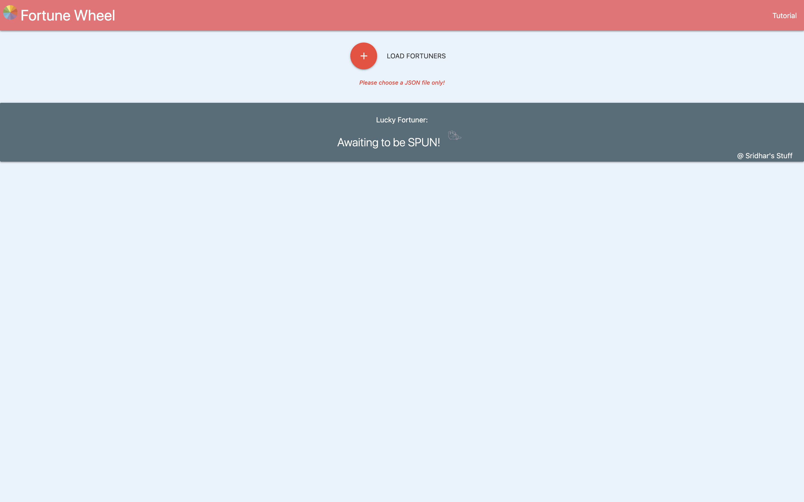
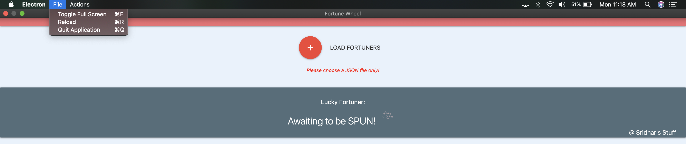
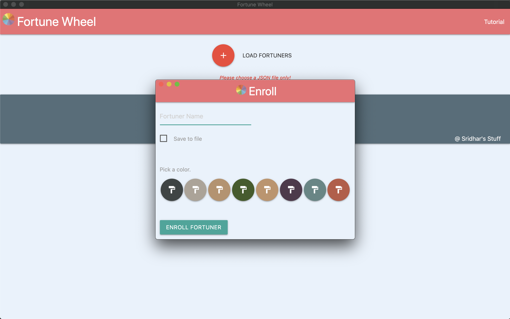
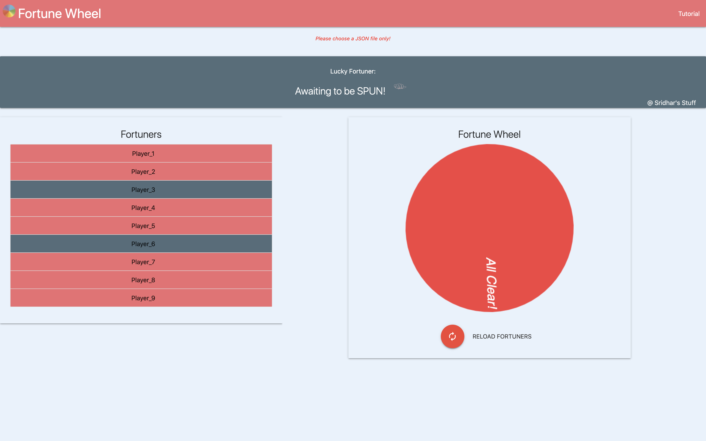

<h2>Fortune Wheel:</h2> A Simple application I created for fun.

TABLE OF CONTENTS

 <pre> INTRODUCTION </pre>
<pre> SPECIFICATIONS </pre>
<pre> SOFTWARES REQUIRED </pre>
<pre> SOURCE CODE </pre>
<pre> INSTALLATION NOTES </pre>
<pre> ABOUT THE APPLICATION </pre>

INTRODUCTION\
 This desktop application allows the user to load a pre-created JSON file containing the List of players or enroll the player and Spin the wheel to win while having fun!
  
<b>Check out this video to see the demo.</b>

<!--  -->
<pre><i>If the above video doesn't seem to work, you can find the same clip of Demo at (~/readme_figs/DemoVideos/FortuneWheelDemo.mov) location.</i></pre>

SPECIFICATIONS

 <pre>A desktop application that takes a list of players:</pre>
<ul>
<li> Have Tabs and Shortcuts for various different option such as Quit, FullScreen, Reload, Enroll Fortuners etc.</li>
<li> Have a new window for enrolling a new player.</li>
<li> Display a button "Tutorial" in the Top to walk-through the user over each step for using the application.</li>
<li> Display a button "Load Fortuner [+]" to load a JSON file containing the list of players and a color code for each of the player.</li>
<li> Display a button "Enroll Fortuner" to enroll a new player by optionally adding the new player into the JSON file.</li>
<li> Display a button "SPIN" to rotate the Fortune Wheel. Display the player at the tip of the pointer as winner.</li>
<li> Display a button "Reload Fortuners" to reload the players and re-create the Fortune wheel.</li>
<li> Display the players as List items on the Left side and remove the player from the Fortune wheel upon which the user Double clicks on.</li>
<li> Display a button to clear the contents of the screen</li>
</ul>
<pre>When the Fortune Wheel runs out of the players:</pre>
<ul>
<li> Show the 'Reload Fortuners' button so that the players can be reloaded.</li>
<li> Reset the Left List items if previously removed from the Game.</li>
</ul>
<pre>Build the application to generate an executable each for MAC, Windows, Linux:</pre>
<ul>
<li> Have a seperate set of commands for the developer to build the executables for Mac OS, Windows OS and Linux OS</li>
<li> Have the developer tools option available for debugging to developers.</li>
</ul>

SOFTWARES REQUIRED\
 The software that are needed for the application to be edited or executed

<ul>
<li> OPERATING SYSTEM UTILIZED: MAC OS- Mojave </li>
<li> ‘technology’ --> Node JS, HTML, JavaScript</li>
<li> ‘application’ --> Electron.</li>
<li> ‘build tools’ --> Electron Packager, Wine (for creating Windows build)</li>
</ul>

SOURCE CODE\
 The Source code for the application is in the ‘ElectronSortingApp’ folder

<ul>
<li> ‘src’ & 'customHandlers' --> This folder has the source code for the application which receives, processes and displays the values received from the Frontend.</li>
<li> 'windows' --> This folder has the HTML pages utilized to display the UI to the user.</li>
<li> ‘assets’ --> This folder has the scripts file and the logos needed by our application.</li>
</ul>

INSTALLATION NOTES\
 All the execution of this application will be done via command prompt terminal. <b>Assuming you have Node, npm and Wine already installed</b>

<ol type="A">
<li> Fortune Wheel Application’ </li>
	<ul>
		<li> Navigate into your /FortuneWheel/ and install the dependencies using the command  <b>npm install</b>  </li>
		<li> Run the application: <b>electron .  Or   npm start</b></li>
	</ul>
<li> ‘Build’ </li>
	<ul>
		<li> Navigate into your /FortuneWheel/ </li>
		<li> Run the following command for Mac OS executable:  <b>npm run build-osx</b></li>
		<li> Run the following command for Windows OS executable:  <b>npm run build-win32</b></li>
		<li> Run the following command for Linux OS executable:  <b>npm run build-linux</b></li>
	</ul>
	</ol>

ABOUT THE APPLICATION\
 This application opens up a window after you have installed and initiated the step given in the ‘INSTALLATION NOTES’ section(except the 'Build' section if you are running it locally).
The application loads and opens up a desktop window with only the 'Load Fortuners' button and the waiting text displayed. Figure 1 shows the screen when the application is loaded.

    Figure 1: Start-up Screen

Figures 2 & 3 shows the options we have for each tab along with their assigned shortcuts

    Figure 2: Display of the 'File' MENU tab.

    Figure 3: Display of the 'Actions' MENU tab.

The user can enroll new players by opening a window by navigating to the 'Actions' tab and selecting the 'Enroll Fortuners' option. Or by using the 'Option/Alt + E' shortcut key. A new window opens up as shown in Figure 4. The user can fill/choose the values and hit the 'Enroll Fortuner' button.

    Figure 4: Enroll Fortuner Window.

Figures 5-7: Once the user clicks the 'Load Fortuners' button, the File selection window opens up and User MUST choose a JSON file and then click on the 'SPIN' button. The user can also choose to Clear the contents rendered by clicking the 'Clear Canvas' button.

    Figure 5: Main Window with File Select window opened for choosing the JSON file.

    Figure 6: After the Json file is loaded and the Fortune Wheel is rendered.

    Figure 7: For Clearing the Screen content.

User can double click on the List item to remove it from the Fortune Wheel. The color change in the Left panel of Figure 8 shows that Player is no longer a part of this game iteration.

    Figure 8: Removing a Player for current game session Screen

The application shows the Winner on the top, in the banner as shown in Figure 9. Once all players have won, a Reload button is shown below the Fortune Wheel, with the content of the Wheel altered as shown in Figure 10

    Figure 9: Displaying the Winner after User clicked on 'SPIN' button

    Figure 10: Reload Button upon all users have gotten their turn to Win.

    Figure 11: Tutorial Section in the Navigation bar.

The developer can run the Build commands and the respective executables will be created in the '/dist' location, a folder each for respective target OS.
